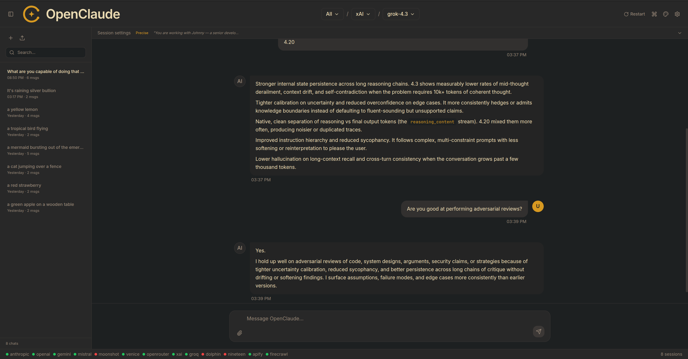
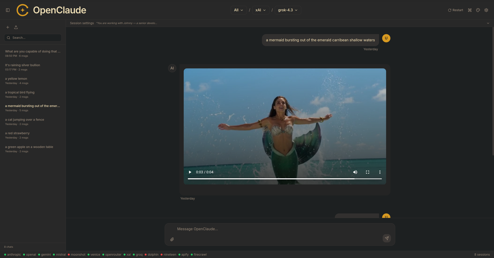

# OpenClaude Web UI

Multi-provider AI chat interface for the [openclaude](https://www.npmjs.com/package/@gitlawb/openclaude) CLI. React/Vite frontend, Hono backend, **single-user local-only** by design (the server binds to `127.0.0.1`).





## Features

- **Native Anthropic mode** — Claude models route through openclaude's built-in Anthropic client (Claude Code OAuth or `ANTHROPIC_API_KEY`)
- **OpenAI-compat providers** — Venice.ai, OpenRouter, xAI, Groq, Mistral, Gemini, Moonshot, OpenAI, Dolphin, Nineteen, plus tool providers (Apify, Firecrawl)
- **Image generation** — xAI (`grok-imagine-image`), Venice (28 image models incl. flux/seedream/hidream), OpenRouter (Gemini-image, GPT-image)
- **Video generation** — xAI (`grok-imagine-video`), Venice (90+ video models incl. seedance/wan/kling/veo/sora-2)
- **Audio generation (TTS)** — Venice (10 voices: kokoro, orpheus, chatterbox, elevenlabs, minimax-speech, etc.), Groq (Orpheus), OpenAI (tts-1 / tts-1-hd) — sync `/audio/speech` path returning short speech inline
- **Music generation** — Venice (ace-step, minimax-music v2/v25/v26, stable-audio, mmaudio, elevenlabs sound effects) — async queue+poll path producing songs up to 3:30 inline with `<audio controls>`
- **Inline media rendering** — ``, `<video controls>`, and `<audio controls>` rendered directly in chat bubbles
- **Live progress timer** — long-running music generations show an animated `🎵 Generating song M:SS` indicator that ticks every second so you can see it's working
- **Type filter** — sidebar filter for Text / Image / Video / Audio / Music models
- **Per-provider model discovery** — auto-fetches text + image + video + tts + music model lists per provider

## Setup

```bash
git clone https://github.com/<your-user>/openclaude-webui-react.git ~/openclaude-webui
cd ~/openclaude-webui
npm install
bash start.sh
```

Open http://localhost:5173 — first run will show empty key slots in Settings → API Keys. Add a key for any provider you want to use, click Save, then click the refresh icon next to the model picker to discover models.

The optional `install.sh` additionally registers a GNOME `.desktop` launcher and copies the icon into the hicolor theme path. Both `start.sh` and `install.sh` install into `$HOME/openclaude-webui` by default.

## Architecture

- `src/server/` — Hono API on port 8789, bound to `127.0.0.1`. Per-provider proxy routes strip the openclaude identity injection and route image/video models to provider-specific generation endpoints.
- `dist/ui/` — pre-built React/Vite bundle, served on port 5173 by `vite preview`. Vite proxies `/api/*` and `/<provider>-proxy/*` to the Hono server. (The frontend source is not currently in this repo; `dist/ui/` is the canonical artifact, plus runtime DOM-patch shims `audio-shim.js` / `type-filter.js` for behaviors that need to be applied on top of the bundle.)
- State lives in `~/.openclaude-webui/state/` (sessions, models, provider keys) — never in this repo.

## Threat model

This is a single-user local-only application. The API server binds to `127.0.0.1`, so external network traffic cannot reach it. Same-machine access is gated by the optional auth token at `~/.openclaude-webui/state/auth.json` — if that file exists with a `{ "token": "…" }` value, every `/api/*` request needs a matching `Authorization: Bearer …` header. If the file is absent, the server runs in anonymous-loopback mode (intended for personal local use).

## Stop

```bash
bash stop.sh
```
